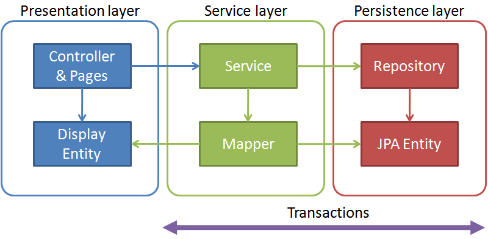

---

---

 

 

## JPA(Java Persistence API)

ORM(Object Relational Mappling)의 기술 표준으로 인터페이스들의 모음을 의미한다. ORM을 사용하기 위한 인터페이스를 모아둔 것들. ORM에 대한 자바 API규격.

 

 

예를 들어 JPA를 구현한 구현체는 아래와 같다.

* Hibernate

  JPA명세의 구현체로 `javax.persistence.EntityManager와` 같은 JPA의 인터페이스를 직접 구현한 라이브러리

* Spring Data JPA

  JPA를 한 단계 추상화시킨 Repository inteface를 제공. 사용자가 Repository interface에 정해진 규율대로 메소드를 입력하면 Spring이 알아서 해당 메소드의 이름에 적합한 쿼리를 날리는 구현체를 만들어 Bean으로 등록

  

