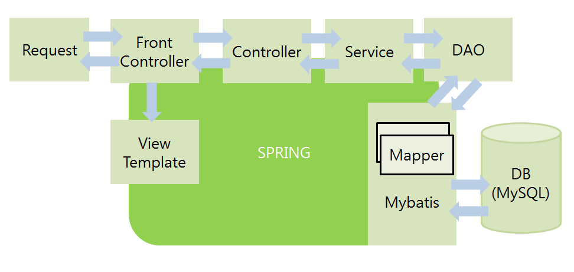

<br><br>

### MyBatis와 MVC 연결

<br>

* pom.xml에 라이브러리를 작성하고 다운로드했으면,ojdbc.jar와 Spring-mybatis를 연동하기 위한 .jar파일(mybatis-spring.jar, spring-jdbc.jar)들이 다운로드 되어있어야 한다.
* 이전까지 Mybatis를 자바에서만 활용했다면, 이제 Spring과 연결하여 DI, IOC, MVC를 함께 사용한다. 
* Session연결은 이제 Spring에서 만들어 넘겨받아야하며, 권한은 스프링이 갖는다.

<br>

#### xml에 환경설정하기 

> 연결 전에 config.xml에서 MyBatis 환경설정을 했다면, 이제 Spring이 연결정보를 만들고 객체를 넘겨준다. Session을 만들어주고 MyBatis가 사용할 db-config.xml파일과  mapping.xml파일의 경로를 남긴다.

* mybatis_spring.xml

  * 해당 파일의 위치는 해당 프로젝트의 사용 패키지 안에 위치 

  ````html
  <?xml version="1.0" encoding="UTF-8"?>
  <beans xmlns="http://www.springframework.org/schema/beans"
  	xmlns:xsi="http://www.w3.org/2001/XMLSchema-instance"
  	xmlns:context="http://www.springframework.org/schema/context"
  	xsi:schemaLocation="http://www.springframework.org/schema/beans http://www.springframework.org/schema/beans/spring-beans.xsd
  		http://www.springframework.org/schema/context http://www.springframework.org/schema/context/spring-context-4.3.xsd">
  
  <!-- 1.데이터소스(데이터연결con)설정 -->
  <bean id="dataSource" 
  class="org.springframework.jdbc.datasource.DriverManagerDataSource" >
  	<property name="driverClassName" 
  	value="oracle.jdbc.driver.OracleDriver" />
  	<property name="url" 
  	value="jdbc:oracle:thin:@localhost:1521:xe" />
  	<property name="username" value="jdbc" />
  	<property name="password" value="jdbc" />			
  </bean>
  
  <!-- 2.SqlSessionFactoryBean : db-config.xml, 
  
  sql-mapping.xml
  board-mapping.xml
  member-mapping.xml
  xxx-mapping.xml
   -->
  <bean id="sqlSessionFactory" class="org.mybatis.spring.SqlSessionFactoryBean">
  	<property name="dataSource" ref="dataSource" />
  	<property name="configLocation" 
  	value="classpath:spring_mybatis/db-config.xml" />	
  	<property name="mapperLocations"
  	value="classpath:spring_mybatis/*-mapping.xml" />
  </bean>
  
  <!-- 3.SqlSessionTemplate api :  
  sqlSessionFactory 객체 생성자에 전달-->
  <bean id="sqlSession" 
  class="org.mybatis.spring.SqlSessionTemplate">
  	<constructor-arg ref="sqlSessionFactory" />
  </bean>
  
  <!-- 4.@annotation :MAIN 사용-->
   <context:component-scan base-package="spring_mybatis" /> 
  
  <!-- web.xml에추가 
  	<context-param>
  		<param-name>contextConfigLocation</param-name>
  		<param-value>/WEB-INF/spring/root-context.xml,
  		classpath:springioc_mybatis/mybatis_spring.xml
  		</param-value>
  	</context-param>
  	
  	servlet-context.xml에추가
  	<context:component-scan 
  base-package="springioc_mybatis" />
  -->
  </beans>
  
  ````

  * 연결하기: 데이터베이스 연결 정보, 접속 계정 정보 입력 필수

  * Session 객체 생성: Location 값에 config.xml과 mapping.xml 경로 기입(필수)

    * 패키지이름/xml이름으로 구성, 패키지 이름이 test.my.mvc일 경우 .은 /로 구분

      ex) 패키지 이름 test.my.mvc > test/my/mvc 

  * @annotation을 사용 할 패키지 이름

    * 패키지명 그대로 작성해주면 된다. (test.my.mvc)

<br>

* board-config.xml파일은 이제 연결정보는 필요 x , 기본 정보와 Alias설정 가능

  ````html
  <?xml version="1.0" encoding="UTF-8" ?>
  <!DOCTYPE configuration
    PUBLIC "-//mybatis.org//DTD Config 3.0//EN"
    "http://mybatis.org/dtd/mybatis-3-config.dtd">
    <!-- mybatis db 연결정보 세팅 파일 -->
  <configuration>
  	<typeAliases>
  		<typeAlias type="test.my.mvc.BoardDTO" alias="board"/> 
  	</typeAliases> 
  </configuration>
  ````

<br>

연결 완료, 이제 mvc에 Mybatis를 사용하면서 mvc의 API, annotation 사용 가능!

Session은 이제 객체를 생성할 필요가 없고, Spring IOC의 bean객체로 저장되어 있기 때문에 DI방식으로(@annotation)으로 생성해 사용한다. 

| MVC기능                          | Mybatis 사용 가능                                            |
| -------------------------------- | ------------------------------------------------------------ |
| @Controller<br />@RequestMapping | @Service<br />@Repository<br />@Component<br />@Autowired<br />@Qualifier |

<br>

* MyBatis와 MVC 구조 



